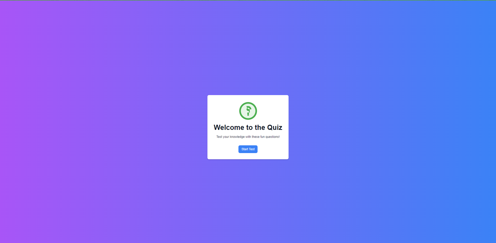
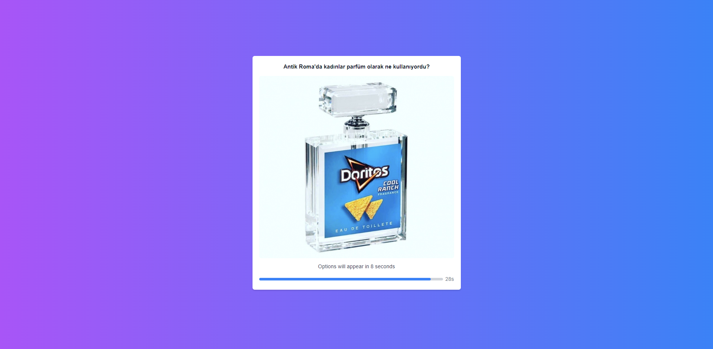
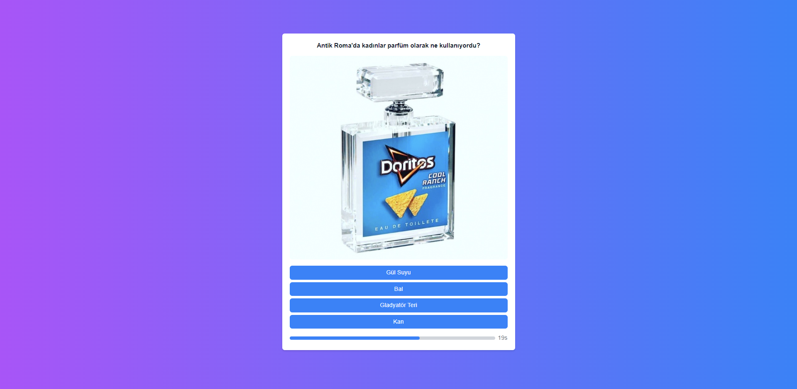
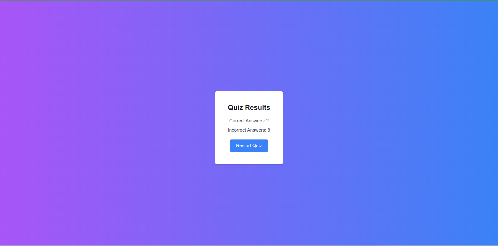

# Quiz App

Bu proje, kullanıcıların rastgele sorulara cevap vererek bilgi testlerini yapabilecekleri bir quiz uygulamasıdır. Proje, React ve Tailwind CSS kullanılarak geliştirilmiştir ve animasyonlar için Framer Motion kütüphanesi kullanılmıştır.

## Kullanılan Teknolojiler

- **React**  : Kullanıcı arayüzlerini oluşturmak için kullanılan bir JavaScript kütüphanesi.
- **Tailwind CSS**: Hızlı bir şekilde modern ve duyarlı kullanıcı arayüzleri oluşturmak için kullanılan bir CSS framework'ü.
- **Framer Motion**: React için animasyon kütüphanesi.
- **Vite**: Hızlı ve optimize edilmiş web projeleri oluşturmak için kullanılan bir geliştirme aracı.

## Proje Görselleri

### Ana Ekran


### Soru Ekranı 1


### Soru Ekranı 2


### Sonuç Ekranı


## Canlı Demo

Projenin canlı demosuna aşağıdaki linkten ulaşabilirsiniz:
[Canlı Netlify Sitesi](https://veccina-question-app.netlify.app)

## Kurulum ve Çalıştırma

Projeyi yerel makinenizde çalıştırmak için aşağıdaki adımları izleyin:

1. Bu repoyu klonlayın:
    ```sh
    git clone
    ```
2. Proje dizinine gidin:
    ```sh
    cd todo-app
    ```
3. Gerekli paketleri yükleyin:
    ```sh
    npm install
    ```
4. Uygulamayı başlatın:
    ```sh
    npm run dev
    ```
## Katkıda Bulunma

Katkılarınızı memnuniyetle karşılıyoruz! Eğer bu proje üzerinde çalışmak isterseniz, lütfen bir fork yapın ve pull request gönderin.
